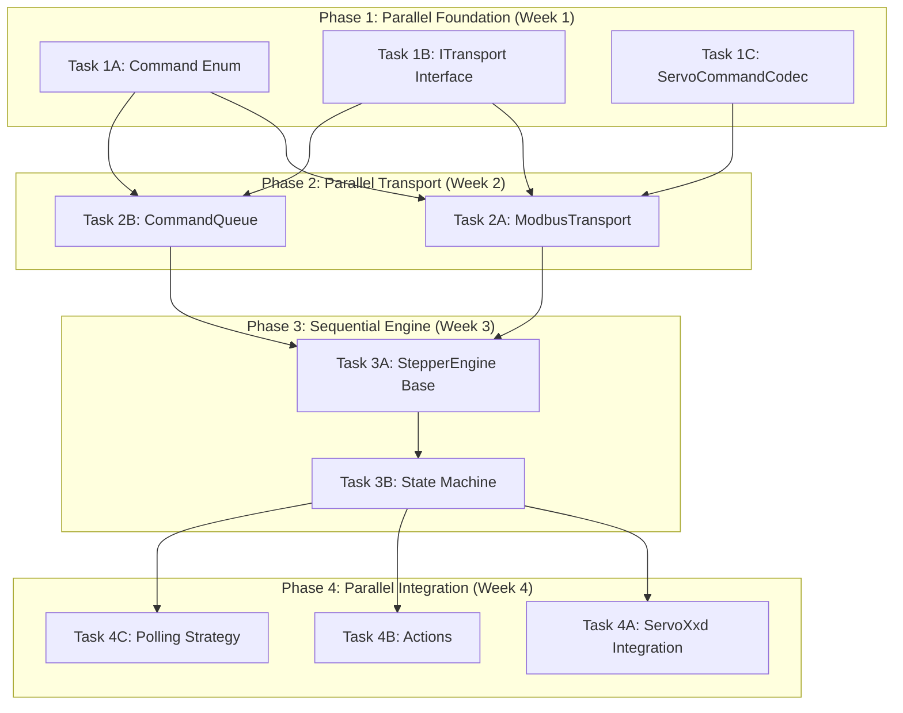

# Implementation Tasks - Structured for Remote AI

> **Base:** [Specification](./specification/)  
> **Strategy:** Parallel branches where possible - each task = 1 branch + unit tests  
> **Existing Code:** ✅ Speed, Acceleration, Position classes are **TESTED** - DO NOT MODIFY

---

## ⚠️ CRITICAL: Existing Tested Code

**The following files have extensive unit tests and MUST NOT be modified:**

```
✅ components/servoxxd/stepper/servoxxd_speed.h/cpp       (494 lines tests)
✅ components/servoxxd/stepper/servoxxd_acceleration.h/cpp (tests exist)
✅ components/servoxxd/stepper/servoxxd_position.h/cpp    (867 lines tests)
```

**Strategy:** All new code must **use** these classes, not modify them.

---

## Task Dependencies Graph (Parallel Execution)



**Parallelization Strategy:**
- ✅ Phase 1: 3 tasks parallel (no dependencies)
- ✅ Phase 2: 2 tasks parallel (independent components)
- ⚠️ Phase 3: Sequential (state machine is complex)
- ✅ Phase 4: 3 tasks parallel (different areas of codebase)

---

---

## 📋 PHASE 1: Foundation (Parallel Execution ✅)

**Timeline:** Week 1 (3 tasks run in parallel)  
**Total:** 4-6 hours (parallel, not sequential!)

### Task 1A: Command Enum

**Branch:** `feature/layer4-command-enum`  
**Spec:** [02d-layer4-transport.md (Lines 36-72)](./specification/02d-layer4-transport.md)  
**Estimated:** 1-2 hours  
**Dependencies:** None ✅  
**Parallel:** Can run with Task 1B, 1C

#### Deliverables

**Files to create:**
- `components/servoxxd/stepper/servoxxd_command.h`

**Implementation:**

```cpp
namespace esphome {
namespace servoxxd {

enum class Command : uint8_t {
  // Read Commands (0x30-0x3F)
  READ_ENCODER_POSITION = 0x30,
  READ_PULSE_COUNT = 0x33,
  READ_IO_PORTS_STATUS = 0x34,
  READ_MOTOR_STATUS = 0x3A,
  READ_PROTECTION_STATUS = 0x3E,
  
  // Write Commands (0x80-0xFF)
  MOVE_POSITION_MODE_2 = 0xFE,
  MOVE_POSITION_MODE_3 = 0xFD,
  STOP = 0xF7,
  ENABLE_MOTOR = 0xF3,
  DISABLE_MOTOR = 0xF3,  // Same code, different data
  // ... all 46 commands
};

}  // namespace servoxxd
}  // namespace esphome
```

#### Acceptance Criteria

- [ ] Enum defines all 46 commands from spec (lines 36-72)
- [ ] Header-only file (no .cpp needed)
- [ ] Compiles independently
- [ ] No dependencies on other new files

#### Testing

```bash
# Compile test
cd tests/unit
g++ -c ../../components/servoxxd/stepper/servoxxd_command.h -I../../
```

---

### Task 1B: ITransport Interface

**Branch:** `feature/layer4-itransport`  
**Spec:** [02d-layer4-transport.md (Lines 113-147)](./specification/02d-layer4-transport.md)  
**Estimated:** 1-2 hours  
**Dependencies:** None ✅  
**Parallel:** Can run with Task 1A, 1C

#### Deliverables

**Files to create:**
- `components/servoxxd/stepper/servoxxd_transport.h`

**Implementation:**

```cpp
namespace esphome {
namespace servoxxd {

enum class TransportError : uint8_t {
  NONE = 0,
  TIMEOUT = 1,
  CRC_ERROR = 2,
  INVALID_RESPONSE = 3,
  BUS_ERROR = 4
};

class ITransport {
 public:
  virtual ~ITransport() = default;
  
  // Execute write command (Modbus 0x06/0x10)
  virtual void execute_command(
      Command cmd,
      const std::vector<uint8_t>& data,
      std::function<void()> on_success,
      std::function<void(TransportError)> on_error) = 0;
  
  // Execute read command (Modbus 0x04)
  virtual void read_command(
      Command cmd,
      size_t expected_bytes,
      std::function<void(const std::vector<uint8_t>&)> on_success,
      std::function<void(TransportError)> on_error) = 0;
  
  virtual bool is_busy() const = 0;
  virtual void update() = 0;
};

}  // namespace servoxxd
}  // namespace esphome
```

#### Acceptance Criteria

- [ ] Pure virtual interface (header-only)
- [ ] TransportError enum defined
- [ ] Callback signatures match spec
- [ ] Compiles independently
- [ ] No implementation required

---

### Task 1C: ServoCommandCodec

**Branch:** `feature/layer4-codec`  
**Spec:** [02d-layer4-transport.md (Lines 74-111)](./specification/02d-layer4-transport.md)  
**Estimated:** 2-3 hours  
**Dependencies:** Task 1A (needs Command enum) ⚠️  
**Parallel:** Can run with Task 1B (different files)

#### Strategy for Existing Code

**⚠️ DO NOT MODIFY:**
- `servoxxd_position.h/cpp` (tested)
- `servoxxd_speed.h/cpp` (tested)
- `servoxxd_acceleration.h/cpp` (tested)

**✅ INSTEAD:** Use their public interfaces:
```cpp
#include "servoxxd_position.h"
#include "servoxxd_speed.h"
#include "servoxxd_acceleration.h"

// Use existing methods:
position.revolutions_internal()  // Get raw values
position.angle_ticks_internal()
speed.rpm_internal()
accel.acc_internal()
```

#### Deliverables

**Files to create:**
- `components/servoxxd/stepper/servoxxd_codec.h`
- `components/servoxxd/stepper/servoxxd_codec.cpp`

**Implementation:**

```cpp
class ServoCommandCodec {
 public:
  // Encode methods (write commands)
  static std::vector<uint8_t> encode_move_position_mode_3(
      const Position& target,
      const Speed& speed,
      const Acceleration& accel,
      bool absolute);
  
  // Decode methods (read responses)
  static Position decode_encoder_position(
      const std::vector<uint8_t>& data,
      const ServoXxd* parent);
  
  static Speed decode_motor_speed(
      const std::vector<uint8_t>& data,
      const ServoXxd* parent);
  
  // ... all encode/decode pairs
};
```

#### Acceptance Criteria

- [ ] Uses existing Position/Speed/Acceleration classes (no modifications)
- [ ] All encode methods pack bytes correctly
- [ ] All decode methods unpack bytes correctly
- [ ] Unit tests verify encode/decode roundtrip
- [ ] No dependencies on transport layer

#### Testing

```cpp
// tests/unit/test_codec.cpp
void test_encode_decode_position() {
  MockServoXxd mock(3200.0f);
  Position pos(180.0f, PositionUnit::DEGREES, &mock);
  Speed spd(100.0f, SpeedUnit::RPM, &mock);
  Acceleration acc(50.0f, AccelerationUnit::RPM_PER_SEC, &mock);
  
  // Encode
  auto bytes = ServoCommandCodec::encode_move_position_mode_3(
      pos, spd, acc, true);
  
  // Verify byte format
  assert(bytes.size() == 10);
  // ... verify each byte
}
```

---

## 📋 PHASE 2: Transport Layer (Parallel Execution ✅)

**Timeline:** Week 2 (2 tasks run in parallel)  
**Total:** 8-10 hours (parallel!)  
**Dependencies:** Phase 1 complete

### Task 2A: ModbusTransport

**Branch:** `feature/layer4-modbus-transport`  
**Spec:** [02d-layer4-transport.md (Lines 182-228)](./specification/02d-layer4-transport.md)  
**Estimated:** 4-5 hours  
**Dependencies:** Task 1A, 1B, 1C  
**Parallel:** Can run with Task 2B (different files)

#### Strategy for Existing Code

**⚠️ EXISTING FILE - DO NOT DELETE:**
- `servoxxd_modbus.h/cpp` already exists
- Contains ServoXxd class implementation
- **DO NOT MODIFY** this file

**✅ INSTEAD:** Create new transport class:
- `servoxxd_modbus_transport.h/cpp` (NEW files)
- Wraps ESPHome's `modbus::ModbusDevice`
- Implements `ITransport` interface

#### Deliverables

**Files to create:**
- `components/servoxxd/stepper/servoxxd_modbus_transport.h` (NEW)
- `components/servoxxd/stepper/servoxxd_modbus_transport.cpp` (NEW)

**Implementation:**

```cpp
class ModbusTransport : public ITransport {
 public:
  ModbusTransport(modbus::ModbusDevice* device, uint8_t slave_address);
  
  void execute_command(...) override;
  void read_command(...) override;
  bool is_busy() const override { return is_executing_; }
  void update() override;
  
  // Called by ServoXxd::on_modbus_data/error
  void on_modbus_data(const std::vector<uint8_t>& data);
  void on_modbus_error(uint8_t function_code, uint8_t exception_code);
  
 private:
  modbus::ModbusDevice* device_;
  uint8_t slave_address_;
  bool is_executing_{false};
  
  std::function<void()> success_callback_;
  std::function<void(TransportError)> error_callback_;
};
```

#### Acceptance Criteria

- [ ] New files created (don't modify servoxxd_modbus.*)
- [ ] Implements ITransport interface
- [ ] execute_command sends Modbus 0x06/0x10
- [ ] read_command sends Modbus 0x04
- [ ] on_modbus_data/error callbacks implemented
- [ ] Unit tests with mock ModbusDevice
- [ ] Hardware test: Read encoder position

---

### Task 2B: CommandQueue

**Branch:** `feature/layer3-command-queue`  
**Spec:** [02c-layer3-command-queue.md](./specification/02c-layer3-command-queue.md)  
**Estimated:** 4-5 hours  
**Dependencies:** Task 1A, 1B (needs Command enum + ITransport)  
**Parallel:** Can run with Task 2A (different files)

#### Strategy for Existing Code

**⚠️ EXISTING FILE - INCOMPLETE:**
- `servoxxd_command_queue.h` exists (header-only skeleton)
- `servoxxd_command_queue.cpp` exists but is EMPTY
- **SAFE TO MODIFY** - no tests yet

#### Deliverables

**Files to update:**
- `components/servoxxd/stepper/servoxxd_command_queue.cpp` (implement)

**Implementation:**

```cpp
void CommandQueue::enqueue(
    Command cmd,
    std::vector<uint8_t> data,
    std::function<void(const std::vector<uint8_t>&)> on_success,
    std::function<void(TransportError)> on_error) {
  
  // Deduplication: Check if identical READ already queued
  if (is_duplicate_read(cmd, data)) {
    return;  // Coalesce
  }
  
  queue_.push_back({cmd, data, on_success, on_error, millis()});
  execute_next();
}

void CommandQueue::execute_next() {
  if (execution_guard_ || queue_.empty()) return;
  
  auto& cmd = queue_.front();
  transport_->execute_command(cmd.command, cmd.data,
      [this]() { on_response_received({}); },
      [this](TransportError e) { on_error_received(e); });
  
  execution_guard_ = true;
  cmd.start_time = millis();
}

void CommandQueue::on_response_received(const std::vector<uint8_t>& data) {
  if (!execution_guard_) return;
  
  auto cmd = queue_.front();
  queue_.pop_front();
  cmd.on_success(data);
  
  execution_guard_ = false;  // CRITICAL!
  execute_next();  // Tail-recursive
}
```

#### Acceptance Criteria

- [ ] Single-flight guarantee (execution_guard_)
- [ ] Deduplication for READ commands
- [ ] Timeout detection in check_timeout()
- [ ] on_response/error clear guard + execute_next()
- [ ] Unit tests: enqueue 3, verify serialization
- [ ] Unit tests: timeout clears guard

---

## 📋 PHASE 3: Engine Core (Sequential ⚠️)

**Timeline:** Week 3 (sequential due to complexity)  
**Total:** 9-12 hours  
**Dependencies:** Phase 2 complete

### Task 3A: StepperEngine Base Structure

**Branch:** `feature/layer2-engine-base`  
**Spec:** [02b-layer2-stepper-engine.md (Lines 1-90)](./specification/02b-layer2-stepper-engine.md)  
**Estimated:** 3-4 hours  
**Dependencies:** Task 2A, 2B  
**Parallel:** ❌ Must complete before Task 3B

#### Strategy for Existing Code

**⚠️ EXISTING FILES - SKELETON:**
- `servoxxd_stepper_engine.h` exists (declarations)
- `servoxxd_stepper_engine.cpp` exists (25+ TODOs)
- **SAFE TO MODIFY** - skeleton only

#### Deliverables

**Files to update:**
- `components/servoxxd/stepper/servoxxd_stepper_engine.h` (complete)
- `components/servoxxd/stepper/servoxxd_stepper_engine.cpp` (base structure)

**Implementation:**

```cpp
class StepperEngine {
 public:
  StepperEngine(ServoXxd* parent, ITransport* transport);
  
  // State machine
  void update();
  EngineState get_state() const { return state_; }
  
  // Public API (stubs for now)
  void move_to(Position target, Speed speed, Acceleration accel);
  void stop(Acceleration decel);
  void emergency_stop();
  void enable();
  void disable();
  
 private:
  EngineState state_{EngineState::DISABLED};
  CommandQueue queue_;
  ITransport* transport_;
  ServoXxd* parent_;  // Access to config
  
  Position current_position_;
  Position target_position_;
};
```

#### Acceptance Criteria

- [ ] EngineState enum defined
- [ ] All public methods declared
- [ ] CommandQueue member instantiated
- [ ] update() method exists (stub OK)
- [ ] Compiles and links
- [ ] Uses existing Position/Speed/Acceleration classes

---

### Task 3B: State Machine Implementation

**Branch:** `feature/layer2-state-machine`  
**Spec:** [02b-layer2-stepper-engine.md (Lines 85-133)](./specification/02b-layer2-stepper-engine.md)  
**Estimated:** 6-8 hours  
**Dependencies:** Task 3A ⚠️ Must complete first  
**Parallel:** ❌ Complex, needs focused work

#### Implementation

Complete all state transitions:

1. **DISABLED → IDLE** (enable):
   ```cpp
   void StepperEngine::enable() {
     validate_state(DISABLED);
     queue_.enqueue(Command::ENABLE_MOTOR,
                    ServoCommandCodec::encode_enable(),
                    [this](auto) { state_ = IDLE; },
                    [this](auto) { handle_error(); });
   }
   ```

2. **IDLE → MOVING** (move_to):
   ```cpp
   void StepperEngine::move_to(Position target, Speed speed, Acceleration accel) {
     validate_state(IDLE);
     target_position_ = target;
     queue_.enqueue(Command::MOVE_POSITION_MODE_3,
                    ServoCommandCodec::encode_move_position_mode_3(
                        target, speed, accel, true),
                    [this](auto) { state_ = MOVING; },
                    [this](auto) { handle_error(); });
   }
   ```

3. **MOVING → IDLE** (target reached, detected in polling)

4. **MOVING → STOPPING** (stop)

5. **ANY → ERROR** (emergency_stop, timeout, protection)

#### Acceptance Criteria

- [ ] All 9 state transitions implemented
- [ ] State validation prevents invalid transitions
- [ ] move_to() uses existing Position/Speed/Acceleration classes
- [ ] Logging for all transitions
- [ ] Unit tests: IDLE → move_to → MOVING
- [ ] Hardware test: motor moves to target

---

## 📋 PHASE 4: Integration (Parallel Execution ✅)

**Timeline:** Week 4 (3 tasks in parallel)  
**Total:** 12-15 hours (parallel!)  
**Dependencies:** Phase 3 complete

### Task 4A: ServoXxd Integration

**Branch:** `feature/layer1-integration`  
**Spec:** [02a-layer1-core.md](./specification/02a-layer1-core.md)  
**Estimated:** 4-5 hours  
**Dependencies:** Task 3B  
**Parallel:** Can run with Task 4B, 4C

#### Strategy for Existing Code

**⚠️ EXISTING FILE - HAS TODOs:**
- `servoxxd.cpp` exists (13 TODOs marked)
- **SAFE TO MODIFY** - TODOs indicate work needed

#### Deliverables

**Files to update:**
- `components/servoxxd/stepper/servoxxd.cpp` (complete TODOs)

**Files to update:**
- `components/servoxxd/stepper/servoxxd.cpp` (complete TODOs)

**Implementation:**

```cpp
void ServoXxd::setup() {
  // Create transport (uses existing modbus::ModbusDevice from base class)
  transport_ = make_unique<ModbusTransport>(this, this->address_);
  
  // Create engine
  engine_ = make_unique<StepperEngine>(this, transport_.get());
  
  // TODO L43: Query motor state
  // TODO L61: Send initial configuration
  // TODO L67: Homing at startup if configured
}

void ServoXxd::loop() {
  // TODO L83: Sync position from base class
  if (this->current_position != engine_->get_current_position().get_steps()) {
    this->current_position = engine_->get_current_position().get_steps();
  }
  
  // TODO L87: Update engine
  engine_->update();
}

void ServoXxd::on_modbus_data(const std::vector<uint8_t>& data) {
  // Forward to transport
  static_cast<ModbusTransport*>(transport_.get())->on_modbus_data(data);
}
```

#### Acceptance Criteria

- [ ] setup() creates ModbusTransport + StepperEngine
- [ ] loop() calls engine_->update()
- [ ] Position sync: base class ↔ engine
- [ ] on_modbus_data/error forward to transport
- [ ] All 13 TODOs resolved
- [ ] Compiles on hardware

---

### Task 4B: Actions Implementation

**Branch:** `feature/actions`  
**Spec:** [02-cpp-interface.md (Lines 195-293)](./specification/02-cpp-interface.md)  
**Estimated:** 5-6 hours  
**Dependencies:** Task 3B  
**Parallel:** Can run with Task 4A, 4C (different files)

#### Strategy for Existing Code

**⚠️ EXISTING FILE - HAS TODOs:**
- `servoxxd_actions.h` exists (18 templates with TODOs)
- **SAFE TO MODIFY** - templates are placeholders

#### Deliverables

**Files to update:**
- `components/servoxxd/stepper/servoxxd_actions.h` (complete all play() methods)

**Implementation:**

```cpp
template<typename... Ts>
class SetTargetAction : public Action<Ts...> {
 public:
  TEMPLATABLE_VALUE(Position, target)
  
  void play(Ts... x) override {
    auto target_val = this->target_.value(x...);
    this->parent_->set_target(target_val);
  }
  
 protected:
  ServoXxd* parent_;
};

// 17 more action templates...
```

#### Acceptance Criteria

- [ ] All 18 action play() methods implemented
- [ ] Templatable evaluation: value.value()
- [ ] Uses existing Position/Speed/Acceleration classes
- [ ] Mode validation (Position vs Speed)
- [ ] YAML example compiles
- [ ] Hardware test: all actions work

---

### Task 4C: Polling Strategy

**Branch:** `feature/polling`  
**Spec:** [02b-layer2-stepper-engine.md (Lines 33-78)](./specification/02b-layer2-stepper-engine.md)  
**Estimated:** 3-4 hours  
**Dependencies:** Task 3B  
**Parallel:** Can run with Task 4A, 4B (adds to engine)

#### Deliverables

**Files to update:**
- `components/servoxxd/stepper/servoxxd_stepper_engine.cpp` (add polling logic)

**Implementation:**

```cpp
void StepperEngine::update() {
  // Polling strategy
  if (millis() - last_poll_time_ > poll_interval_ms_) {
    queue_.enqueue(Command::READ_ENCODER_POSITION, {},
        [this](const auto& data) {
          current_position_ = ServoCommandCodec::decode_encoder_position(
              data, parent_);
          check_target_reached();
        },
        [this](auto) { /* handle error */ });
    
    queue_.enqueue(Command::READ_MOTOR_STATUS, {},
        [this](const auto& data) { update_motor_status(data); },
        [this](auto) { /* handle error */ });
    
    last_poll_time_ = millis();
  }
  
  queue_.update();
}

void StepperEngine::check_target_reached() {
  if (state_ == MOVING && 
      abs(current_position_.ticks_total() - target_position_.ticks_total()) < 50) {
    state_ = IDLE;
    ESP_LOGD(TAG, "Target reached");
  }
}
```

#### Acceptance Criteria

- [ ] Polls encoder every poll_interval_ms_ (default 200ms)
- [ ] Polls motor status
- [ ] Polls protection status
- [ ] Decodes responses using ServoCommandCodec
- [ ] Updates current_position_
- [ ] Detects target reached → MOVING → IDLE
- [ ] Hardware test: position updates in real-time

---

## 🎯 Summary

### Parallelization Matrix

| Week | Parallel Tasks | Sequential Tasks | Total Hours |
|------|----------------|------------------|-------------|
| 1    | 3 (1A, 1B, 1C) | -                | 4-6h        |
| 2    | 2 (2A, 2B)     | -                | 8-10h       |
| 3    | -              | 2 (3A, 3B)       | 9-12h       |
| 4    | 3 (4A, 4B, 4C) | -                | 12-15h      |

**Total: 33-43 hours estimated**

**Real-world timeline:**
- **Sequential execution:** 9 tasks × 4h avg = 36 days (1 task/day, 4h/day)
- **Parallel execution:** 4 weeks × 5 days = 20 days (with parallelization)

### Strategy for Existing Code

**✅ DO NOT MODIFY (Tested):**
- `servoxxd_speed.h/cpp` - 494 lines of tests
- `servoxxd_acceleration.h/cpp` - unit tests exist
- `servoxxd_position.h/cpp` - 867 lines of tests

**✅ SAFE TO MODIFY (Skeleton/TODOs):**
- `servoxxd_command_queue.cpp` - empty file
- `servoxxd_stepper_engine.cpp` - 25+ TODOs
- `servoxxd.cpp` - 13 TODOs
- `servoxxd_actions.h` - template placeholders

**✅ CREATE NEW:**
- `servoxxd_command.h` - Command enum
- `servoxxd_transport.h` - ITransport interface
- `servoxxd_codec.h/cpp` - ServoCommandCodec
- `servoxxd_modbus_transport.h/cpp` - ModbusTransport (don't confuse with servoxxd_modbus.*)

### AI Workflow for Each Task

1. **Read Specification:** AI reads specified lines from spec file
2. **Check Existing Code:** AI checks which files exist and their status
3. **Create/Modify:** AI creates new files OR modifies files with TODOs
4. **Use Tested Code:** AI uses Position/Speed/Acceleration public interfaces, never modifies them
5. **Write Tests:** AI writes unit tests
6. **Hardware Test:** AI creates YAML for hardware testing
7. **Create PR:** AI creates branch + PR with description

### Example AI Prompt for Task 1A

```
Implement Task 1A: Command Enum

Read specification: docs/specification/02d-layer4-transport.md lines 36-72
Create file: components/servoxxd/stepper/servoxxd_command.h

Requirements:
- Define enum class Command : uint8_t
- Include all 46 command codes from specification
- Header-only file (no .cpp)
- No dependencies on other new files
- Must compile independently

DO NOT modify:
- servoxxd_speed.h/cpp
- servoxxd_acceleration.h/cpp  
- servoxxd_position.h/cpp

Create branch: feature/layer4-command-enum
Run test: g++ -c servoxxd_command.h -I../../
Create PR with title: "feat(layer4): Add Command enum (Task 1A)"
```

---

## 📝 Notes for Remote AI

**Critical Rules:**

1. **Never modify tested code** (Speed, Acceleration, Position classes)
2. **Use existing public interfaces** - don't reinvent the wheel
3. **Follow naming conventions** - servoxxd_* prefix for all files
4. **Include ESPHome namespace** - `namespace esphome { namespace servoxxd { ... }}`
5. **Add logging** - `ESP_LOGD/I/W/E` for all state transitions
6. **Write unit tests** - tests/unit/test_*.cpp for each component
7. **Create hardware tests** - tests/esphome/test_*.yaml
8. **Document TODOs** - if something can't be done yet, add TODO with reason

**Merge Strategy:**

- Each task creates a feature branch
- Branch merges to `develop` after tests pass
- Keep PRs small (1 task = 1 PR)
- Sequential merge (don't merge Task 2A before Task 1A/1B/1C)
- Final merge `develop` → `main` after all tasks complete
