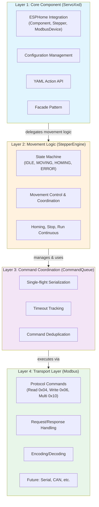

# C++ Interface Specification

Status: 🔵 SPECIFICATION – Defines the C++ architecture and public API for the servoxxd component implementation

Audience: This document is for developers implementing the ESPHome C++ component. It is binding to the user-facing API defined in [01-yaml-api.md](./01-yaml-api.md) and [README.md](../../README.md).

Purpose: Provide a clear, cohesive design for the C++ classes, methods, responsibilities, data flow, and contracts that implement the YAML API and behavior. The existing code can inform the design, but the implementation may be rewritten following this spec.

> **📚 Documentation Structure:** This document provides an overview and API reference. For detailed layer-specific implementation information, see:
> - [02a-layer1-core.md](./02a-layer1-core.md) - Layer 1 (ServoXxd) details
> - [02b-layer2-stepper-engine.md](./02b-layer2-stepper-engine.md) - Layer 2 (StepperEngine) details
> - [02c-layer3-command-queue.md](./02c-layer3-command-queue.md) - Layer 3 (CommandQueue) details
> - [02d-layer4-transport.md](./02d-layer4-transport.md) - Layer 4 (Modbus) details

## Design goals

- Honor [README.md](../../README.md) and [01-yaml-api.md](./01-yaml-api.md) exactly (names, types, behavior, notes)
- Clean separation of concerns: device, control, positioning, command queue, conversions
- Deterministic, serial Modbus command execution with timeouts and deduplication
- Stable public API for actions/configs; internal details are free to evolve
- Explicit units for all public methods; centralized conversions internally
- Safe defaults and clamps to hardware limits; protect mechanics on stop

## High-level architecture

**Component Name:** `servoxxd` (transport-agnostic platform name)

**Architecture Overview:**

The component uses a modular four-layer architecture that separates concerns and enables future transport alternatives:



### Layer 1: Core Component (Transport-Agnostic)

**Class:** [ServoXxd](../../components/servoxxd/stepper/servoxxd.h)  
**Files:** `servoxxd.h` / `servoxxd.cpp`  
**Inherits:** [stepper::Stepper](https://esphome.io/components/stepper/), [modbus::ModbusDevice](https://esphome.io/components/modbus.html), esphome::Component

**Responsibilities:**

- Component lifecycle (setup, loop, dump_config)
- Configuration management (setters for all YAML parameters)
- YAML action API (enable, disable, set_target, home, etc.)
- Modbus callbacks (delegates to transport layer)
- Synchronization with ESPHome base classes
- Delegates all movement logic to StepperEngine

**Design Pattern:** Facade - provides simple interface to complex subsystem

**[→ Detailed Layer 1 Specification](./02a-layer1-core.md)**

### Layer 2: Movement Logic (Transport-Agnostic)

**Class:** [StepperEngine](../../components/servoxxd/stepper/servoxxd_stepper_engine.h)  
**Files:** `servoxxd_stepper_engine.h` / `servoxxd_stepper_engine.cpp`

**Responsibilities:**

- State machine implementation (IDLE, MOVING, HOMING, STOPPING, ERROR, etc.)
- Movement control and coordination (position mode, speed mode)
- Homing sequence execution
- Stop and emergency stop handling
- Run continuous logic
- Error handling and recovery
- Manages CommandQueue (Layer 3)
- Processes transport callbacks (response, error, timeout)
- Communicates with ServoXxd for configuration and status

**Design Pattern:** State Machine + Strategy

**[→ Detailed Layer 2 Specification](./02b-layer2-stepper-engine.md)**

### Layer 3: Command Coordination (Transport-Agnostic)

**Class:** [CommandQueue](../../components/servoxxd/stepper/servoxxd_queue.h)  
**Files:** `servoxxd_queue.h` / `servoxxd_queue.cpp`  
**Managed by:** StepperEngine

**Responsibilities:**

- Serialize transport commands (single-flight execution)
- Timeout tracking and expiration
- Command deduplication (prevent redundant requests)
- Queue management (enqueue, process, complete, fail)
- Callback coordination (success, error, timeout)

**Design Pattern:** Command Queue + Single Flight

**[→ Detailed Layer 3 Specification](./02c-layer3-command-queue.md)**

### Layer 4: Transport Layer (Protocol-Agnostic Commands + Transport Implementation)

**⚠️ Refactoring in Progress:** See [Transport Abstraction Refactoring](./02d-layer4-transport-refactoring.md) for details

**Layer 4a: Semantic Commands** (Transport-Agnostic)  
**Files:** `servoxxd_command.h` / `servoxxd_command.cpp` (renamed from `servoxxd_modbus.*`)

**Responsibilities:**

- Transport-agnostic register commands:
  - `ReadRegisterCommand(register, count)`
  - `WriteRegisterCommand(register, value)`
  - `WriteMultipleRegistersCommand(register, values)`
- Command state tracking (PENDING → EXECUTING → COMPLETED/FAILED/TIMEOUT)
- Request/response coordination via `ITransport` interface
- No knowledge of protocol specifics (Modbus, Serial, CAN)

**Layer 4b: Transport Interface + Implementations**  
**Files:** `servoxxd_transport.h`, `servoxxd_modbus_transport.h/.cpp`

**Responsibilities:**

- **ITransport Interface:** Abstract protocol methods (`send_read`, `send_write`, etc.)
- **ModbusTransport:** Modbus-RTU implementation (functions 0x04/0x06/0x10)
- **Future:** SerialTransport, CANTransport, etc.
- Protocol encoding/decoding
- Response routing to commands

**Future Extensibility:**

- ✅ Commands work with any transport (Modbus, Serial, CAN)
- ✅ Same Layers 1-3, swap Layer 4b implementation
- ✅ Easy to add new hardware protocols

**[→ Detailed Layer 4 Specification](./02d-layer4-transport.md)**

### Supporting Classes

**Unit Conversion & Value Storage:**

- **Files:** `servoxxd_speed.h/.cpp`, `servoxxd_acceleration.h/.cpp`, `servoxxd_position.h/.cpp`
- **Purpose:**
  - Type-safe unit conversion (steps, degrees, RPM, etc.)
  - Optimized getter types based on mathematical analysis
  - Parent pointer for runtime configuration access (steps_per_rev, microsteps)
  - Hardware value storage (minimize memory footprint)

---

## Implementation Details

For detailed implementation specifications of each layer, see the dedicated documentation files:

- **[Layer 1 (ServoXxd) - Core Component](./02a-layer1-core.md)**
  - Base class integration, responsibilities, configuration, runtime state
  
- **[Layer 2 (StepperEngine) - Movement Logic](./02b-layer2-stepper-engine.md)**
  - State machine, command validation matrix, polling strategy, public methods
  
- **[Layer 3 (CommandQueue) - Command Coordination](./02c-layer3-command-queue.md)**
  - Single-flight guarantee, execution flow, smart command management
  
- **[Layer 4 (Modbus) - Transport Layer](./02d-layer4-transport.md)**
  - Command classes, state machine, protocol details

---

## Public C++ API (binding)

These methods implement the YAML actions and configuration setters. Names, signatures, and semantics must match [01-yaml-api.md](./01-yaml-api.md).

### Configuration setters (called by ESPHome during setup)

ESPHome's generated `main.cpp` calls these setters during component initialization to apply YAML configuration values.

#### Basic configuration

```cpp
void set_steps_per_revolution(float steps);  // YAML: steps_per_revolution
void set_microsteps(uint16_t subdivision);  // 1–256, YAML: microsteps
void set_speed(Speed speed);  // YAML: speed (alias: max_speed)
void set_acceleration(Acceleration acceleration);  // YAML: acceleration (affects both accel and decel)
void set_sleep_when_done(uint32_t timeout_ms);  // UINT32_MAX = disabled, 0 = immediate, 1+ = delay in ms, YAML: sleep_when_done
void set_servo_type(ServoType type);  // SERVO28D, SERVO35D, SERVO42D, SERVO57D, YAML: servo_type
void set_control_mode(WorkMode mode);  // SR_OPEN, SR_CLOSE, SR_VFOC, YAML: control_mode
void set_working_current(uint16_t current_milliamps);  // 0-5200mA depending on servo_type, YAML: working_current (hardware: Command 0x83, uint16_t)
void set_holding_current_percent(uint8_t percent);  // YAML: holding_current_percent
void set_en_pin_active(EnPinActive polarity);  // LOW, HIGH, ALWAYS, YAML: en_pin_active
void set_auto_screen_off(bool enable);  // YAML: auto_screen_off
void set_lock_keys_at_startup(bool lock);  // YAML: lock_keys_at_startup
void set_mode(OperatingMode mode);  // POSITION, SPEED, YAML: mode
```

[YAML reference](./01-yaml-api.md#basic-configuration)

#### Position mode configuration

```cpp
void set_homing_mode(HomingMode mode);  // ENDSTOP, SENSORLESS, VIRTUAL, YAML: homing.mode
void set_homing_at_startup(bool enable);  // YAML: homing.at_startup
void set_homing_direction(HomingDirection dir);  // CW, CCW, NEAREST, YAML: homing.direction
void set_homing_speed(Speed speed);  // for ENDSTOP/SENSORLESS, YAML: homing.speed
void set_homing_speed_level(uint8_t level);  // 0–4 for VIRTUAL, YAML: homing.speed (zeroing_speed type)
void set_homing_endstop_trigger(EndstopTrigger trigger);  // HIGH, LOW, YAML: homing.endstop_trigger
void set_homing_current(uint16_t current_milliamps);  // 0-5200mA depending on servo_type, YAML: homing.current (hardware: Command 0x94, uint16_t)
```

[YAML reference](./01-yaml-api.md#position-mode-configuration)

#### Speed mode configuration

No additional methods required (uses initial_speed and initial_acceleration).

[YAML reference](./01-yaml-api.md#speed-mode-configuration)

### Actions

#### Both modes

```cpp
void enable();  // YAML: stepper.enable
void disable();  // YAML: stepper.disable
void emergency_stop();  // YAML: stepper.emergency_stop
void stop(std::optional<Acceleration> deceleration);  // YAML: stepper.stop
void calibrate();  // YAML: stepper.calibrate
void release_protection();  // YAML: stepper.release_protection
void restart();  // YAML: stepper.restart
void key_lock();  // YAML: stepper.key_lock
void key_unlock();  // YAML: stepper.key_unlock
```

[YAML reference](./01-yaml-api.md#basic-actions)

#### Position mode only

```cpp
// Overloaded set_target methods:
void set_target(Position target);  // YAML: stepper.set_target - our implementation with Position type
// Note: Base class void set_target(int32_t steps) is also available (called by ESPHome actions)
// Both overloads coexist: Position version for our API, int32_t version for ESPHome compatibility

void report_position(Position position);  // YAML: stepper.report_position
// Note: Base class void report_position(int32_t steps) is also available (called by ESPHome actions)
void home(bool no_restart = false);  // YAML: stepper.home
void set_zero();  // YAML: stepper.set_zero
```

> [!NOTE]
> Base class void set_target(int32_t steps) is also available (called by ESPHome actions)

[YAML reference](./01-yaml-api.md#position-mode-actions)

#### Speed mode only

```cpp
void run_continuous(std::optional<Speed> speed, std::optional<Acceleration> acceleration);  // YAML: stepper.run_continuous
```

[YAML reference](./01-yaml-api.md#speed-mode-actions)

### Runtime configuration changes (action-based)

```cpp
void set_work_mode(WorkMode mode);  // SR_OPEN, SR_CLOSE, SR_VFOC, YAML: stepper.set_work_mode
void set_working_current(uint16_t current_milliamps);  // 0-5200mA depending on servo_type, YAML: stepper.set_working_current
void set_holding_current_percent(uint8_t percent);  // YAML: stepper.set_holding_current_percent
void set_microstepping(uint16_t subdivision);  // 1–256, YAML: stepper.set_microstepping
void set_speed(Speed speed);  // YAML: stepper.set_speed
void set_acceleration(Acceleration acceleration);  // YAML: stepper.set_acceleration (affects both accel and decel)
```

[YAML reference](./01-yaml-api.md#runtime-configuration-actions)

> [!IMPORTANT]
> **Hardware Limitation:** The motor controller does not support separate acceleration and deceleration values. The `set_acceleration` method affects both rates. A `stepper.set_deceleration` action in YAML will cause a validation error.

> [!NOTE]
> All methods are non-blocking: they enqueue Modbus commands and return immediately. Unit conversions and hardware clamps are applied before enqueueing.

### Unit Type Definitions

The component uses strongly-typed classes for values with units to enable compile-time and runtime unit conversions with automatic overflow protection:

#### Speed Type

```cpp
class Speed {
  friend class ServoXxd;
 public:
  Speed(float value, SpeedUnit unit, const ServoXxd* parent);
  explicit Speed(const ServoXxd* parent) : rpm_(0), parent_(parent) {}

  // Optimized getters: int for linear conversions, float for fractional
  int16_t get_rpm() const;                    // Direct hardware value (int16_t, -3000 to +3000)
  int32_t get_steps_per_sec() const;          // Linear conversion (int32_t, uses stored parent_)
  float get_rev_per_sec() const;              // Fractional conversion (rpm/60 → duplicates with int)
  int32_t get_degrees_per_sec() const;        // Linear conversion (int32_t, rpm × 6)
  float get_radians_per_sec() const;          // Fractional conversion (rpm×2π/60 → duplicates with int)
  int32_t get_degrees_per_min() const;        // Linear conversion (int32_t, rpm × 6)
  int32_t get_degrees_per_hour() const;       // Linear conversion (int32_t, rpm × 360)
  
  // Legacy compatibility methods
  float rpm() const;                          // User-facing RPM (float)
  int16_t rpm_as_i16() const;                 // Rounded RPM (int16_t)
  int16_t rpm_for_hardware() const;           // Microstepping-compensated RPM (uses stored parent_)
  float steps_per_sec() const;                // Steps per second (uses stored parent_)
  
  // Direct accessor to internal representation
  int16_t rpm_internal() const;               // Direct hardware value access
  
 private:
  int16_t rpm_{0};                            // Hardware-native: RPM (signed, -3000 to +3000, calibrated for 16 microsteps)
  const ServoXxd* parent_{nullptr};     // Parent component (for microstepping and steps_per_revolution)
};

enum class SpeedUnit : uint8_t {
  STEPS_PER_SEC = 0,
  RPM = 1,
  REV_PER_SEC = 2,
  DEGREES_PER_SEC = 3,
  RADIANS_PER_SEC = 4,
  DEGREES_PER_MIN = 5,
  DEGREES_PER_HOUR = 6
};
```

> [!CAUTION]
> **Hardware Speed Calibration (Microstepping Dependency)**
>
> The motor controller's speed values are **calibrated for 16/32/64 subdivisions** as reference. For other microstepping settings, the hardware applies an automatic scaling factor based of 16 subdivisions:
> `asked_speed = actual_speed × (16 / current_microsteps)`
>
> | Microsteps | Hardware Scaling | Example: Send 1200 → Actual Motor Speed |
> |------------|------------------|------------------------------------------|
> | 8          | * 2              | 1200 → 2400 RPM                          |
> | 16/32/64   | × 1 (reference)  | 1200 → 1200 RPM                          |
> | 128        | ÷ 8              | 1200 → 150 RPM                           |
> | 256        | ÷ 16             | 1200 → 75 RPM                            |
>
> **Implementation:** `rpm_for_hardware()` uses stored `parent_` to apply inverse scaling if microstepping is not 16, 32 or 64.

[YAML reference](./01-yaml-api.md#speed-type)

#### Acceleration Type

```cpp
class Acceleration {
  friend class ServoXxd;
 public:
  Acceleration(float value, AccelerationUnit unit, const ServoXxd* parent);
  explicit Acceleration(const ServoXxd* parent) : acc_(0), parent_(parent) {}

  // Optimized getters: float required for all units (non-linear mapping causes duplicates with int)
  float get_steps_per_sec2() const;           // Steps/s² (uses stored parent_)
  float get_rpm_per_sec() const;              // RPM/s (approximate due to non-linear hardware mapping)
  float get_rev_per_sec2() const;             // Rev/s² (approximate)
  float get_degrees_per_sec2() const;         // Deg/s² (approximate)
  float get_radians_per_sec2() const;         // Rad/s² (approximate)
  
  // Generic getter
  float get(AccelerationUnit unit) const;     // Universal accessor
  
  // Direct accessor to internal representation
  uint8_t acc_internal() const;               // Hardware value 0-255
  
  // Legacy compatibility methods
  float rpm_per_sec() const;                  // Approximate RPM/s (for display/logging)
  float steps_per_sec2() const;               // Steps/s² for ESPHome (uses stored parent_)
  
 private:
  uint8_t acc_{0};                            // Hardware-native: 0-255 (inverse time mapping)
  const ServoXxd* parent_{nullptr};     // Parent component (for steps_per_revolution)
};

enum class AccelerationUnit : uint8_t {
  STEPS_PER_SEC_SQ = 0,
  RPM_PER_SEC = 1,
  REV_PER_SEC_SQ = 2,
  DEGREES_PER_SEC_SQ = 3,
  RADIANS_PER_SEC_SQ = 4
};
```

> [!CAUTION]
> **Hardware Acceleration Encoding (Inverse Time Mapping)**
>
> Die Hardware verwendet einen **nicht-linearen Wert 0-255**, der die Zeitdauer zwischen diskreten Geschwindigkeitsänderungen von ±1 RPM steuert:
>
> **Fundamentale Beziehung:**
>
> ```text
> acc = 0:    Keine Beschleunigung (Motor springt sofort auf Zielgeschwindigkeit)
> acc = 1-255: Δt = (256 - acc) × 50 μs  (Zeit zwischen ±1 RPM Änderungen)
> ```
>
> - `acc`: Hardware-Wert (0-255, wird an Motor gesendet)
> - `Δt`: Zeitintervall zwischen aufeinanderfolgenden Geschwindigkeitsänderungen von ±1 RPM
> - Bei `acc=0`: **Spezialfall** - keine Rampe, direkte Geschwindigkeitsänderung (∞ RPM/s)
> - Bei `acc=1`: Langsamste Beschleunigung (Δt = 12,75 ms → ~78 RPM/s)
> - Bei `acc=255`: Schnellste Beschleunigung (Δt = 50 μs → 20000 RPM/s)
>
> **Umrechnung User-Eingabe → Hardware:**
>
> Gegeben: Gewünschte Beschleunigung `a_user` in RPM/s
>
> ```text
> Für a_user = ∞ (keine Rampe):   acc = 0
> Für a_user > 0 (mit Rampe):     acc = 256 - (20000 / a_user)
>                                 acc = max(1, min(255, berechnet))
> ```
>
> **Umrechnung Hardware → Effektive Rate:**
>
> ```text
> Für acc = 0:       a_eff = ∞ (sofortige Änderung)
> Für acc = 1-255:   a_eff = 20000 / (256 - acc)  [RPM/s]
> ```
>
> **Wichtig:**
>
> - **acc=0 ist Spezialfall:** Wert aus YAML wird direkt übernommen, keine Rampe
> - Nicht microstepping-kalibriert (im Gegensatz zu Speed)
> - Gilt für bereits skalierte RPM-Werte
> - Nicht-lineare Beziehung: kleine acc-Änderungen bei hohen Werten → große Effekt-Unterschiede

> [!NOTE]
> **Friend Class Design:** Stores only `uint8_t acc_` (1 byte) hardware value. Conversions to user-facing RPM/s are approximate due to non-linear mapping. Constructor maps user units to nearest hardware value using inverse formula.

[YAML reference](./01-yaml-api.md#acceleration-type)

#### Position Type

```cpp
class Position {
  friend class ServoXxd;
 public:
  Position(float value, PositionUnit unit, const ServoXxd* parent);
  explicit Position(const ServoXxd* parent) : revs_(0), angle_ticks_(0), parent_(parent) {}
  
  // Factory methods for direct construction
  static Position from_ticks(int64_t ticks);
  static Position from_steps(int64_t steps, const ServoXxd* parent);  // Only this needs parent!
  static Position from_revolutions(double revolutions);
  static Position from_degrees(double deg);
  static Position from_radians(double rad);
  static Position from_arcminutes(int64_t arcminutes);
  static Position from_arcseconds(int64_t arcseconds);
  
  // Direct accessors to internal representation
  int32_t revolutions_internal() const;       // Raw revolutions count
  uint16_t angle_ticks_internal() const;      // Raw angle ticks (0-16383)
  uint64_t ticks_total() const;               // Total encoder ticks
  
  // Optimized getters: float for all units (hardware uses split format, conversions are exact)
  int32_t get_steps() const;                  // Steps (uses stored parent_)
  float get_revolutions() const;              // Revolutions (exact)
  float get_degrees() const;                  // Degrees (exact)
  float get_radians() const;                  // Radians (exact)
  float get_arcminutes() const;               // Arcminutes (exact)
  float get_arcseconds() const;               // Arcseconds (exact)
  
  // Generic getter
  float get(PositionUnit unit) const;         // Universal accessor
  
  // Operators
  Position operator+(const Position& rhs) const;
  Position operator-(const Position& rhs) const;
  bool operator==(const Position& rhs) const;
  bool operator!=(const Position& rhs) const;
  
 private:
  static constexpr uint32_t TICKS_PER_REV = 16384u;
  int32_t revs_{0};                           // Full revolutions (signed)
  uint16_t angle_ticks_{0};                   // Angle within revolution (0-16383)
  const ServoXxd* parent_{nullptr};     // Parent component (for steps_per_revolution)
};

enum class PositionUnit : uint8_t {
  STEPS = 0,
  REVOLUTIONS = 1,
  DEGREES = 2,
  RADIANS = 3,
  ARCMINUTES = 4,
  ARCSECONDS = 5
};
```

> [!CAUTION]
> **Hardware Position Encoding (Split Format)**
>
> Die Hardware verwendet ein **Split-Format** basierend auf dem integrierten Encoder:
>
> **Fundamentale Struktur:**
>
> ```text
> Position = revolutions + (angle_ticks / 16384)
> ```
>
> - `revolutions`: Vollständige Umdrehungen (int32_t, -2^31..2^31-1)
> - `angle_ticks`: Winkelposition innerhalb einer Umdrehung (uint16_t, 0-16383)
> - `TICKS_PER_REV = 16384`: Encoder-Konstante (Hardware-fest, 2^14 Ticks pro Umdrehung)
>
> **Carry/Borrow Verhalten:**
>
> ```text
> Wenn angle_ticks ≥ 16384:  revolutions++, angle_ticks -= 16384  (Überlauf → nächste Umdrehung)
> Wenn angle_ticks < 0:      revolutions--, angle_ticks += 16384  (Unterlauf → vorherige Umdrehung)
> ```
>
> Valider Bereich: `angle_ticks` ist immer [0, 16383], Über-/Unterlauf wird in `revolutions` getragen
>
> **Umrechnung:**
>
> User → Hardware (Split):
>
> ```text
> total_ticks = (value × steps_per_rev × 16384) / steps_per_rev
> revs = total_ticks / 16384           (Division mit Vorzeichen)
> angle_ticks = total_ticks % 16384    (Modulo immer positiv 0-16383)
> ```
>
> Hardware (Split) → Total Ticks:
>
> ```text
> total_ticks = (revs × 16384) + angle_ticks
> ```
>
> **Wichtig:**
>
> - Encoder-natives Format (direkt aus Hardware-Feedback)
> - Arithmetik erfolgt auf `total_ticks`, dann Re-Split mit Carry/Borrow-Handling
> - Conversions zu Steps benötigen `steps_per_revolution` (via parent pointer)

**Key Design Features:**

1. **Friend classes**: Access to parent's `steps_per_revolution_` and `microsteps_` without storing pointers
2. **Hardware-native storage**:
   - Speed: `int16_t rpm_` (2 bytes, -3000..3000, microstepping-calibrated)
   - Acceleration: `uint8_t acc_` (1 byte, 0-255, inverse time mapping, NOT microstepping-scaled)
   - Position: `int32_t revs_` + `uint16_t angle_ticks_` (6 bytes, encoder-aligned split format)
3. **Minimal footprint**: Total 9 bytes for all three types
4. **Optimized return types**: Getters return int where mathematically safe, float where required for precision

**Type Optimization Rationale:**

The getter return types are carefully chosen based on mathematical analysis to minimize data loss while maintaining performance:

**Speed Class:**
- **int16_t** for `get_rpm()`: Hardware stores RPM as int16_t internally → zero conversion loss
- **int32_t** for linear conversions (`get_steps_per_sec()`, `get_degrees_per_sec()`, `get_degrees_per_min()`, `get_degrees_per_hour()`): 
  - These are simple integer multiplications of RPM with no fractional components
  - Constraint: `200 <= steps_per_rev <= 102400` ensures no overflow in int32_t range
  - Example: RPM × 6 for degrees/sec, RPM × 360 for degrees/hour
- **float** for fractional conversions (`get_rev_per_sec()`, `get_radians_per_sec()`):
  - `rpm/60` creates fractional values → int causes massive duplicates (RPM 0-5 all map to 0)
  - `rpm×(2π/60)` also fractional → int loses precision (RPM 0-2 all map to 0)
  - Proven by systematic duplicate testing across all 6001 RPM values

**Acceleration Class:**
- **float** for all getters: Hardware uses non-linear inverse time mapping (0-255 → 20000/(256-acc) RPM/s)
  - Any hardware value 0-255 can map to any acceleration rate
  - Conversions are inherently approximate due to discrete 0-255 hardware steps
  - Integer types would introduce massive rounding errors and duplicates
  - Proven by duplicate analysis: uint/int cause collisions at all acceleration values

**Position Class:**
- **int32_t** for `get_steps()`: Direct conversion from encoder ticks with no precision loss
- **float** for all other units: Split format (revolutions + angle_ticks) requires fractional representation
  - Encoder resolution: 16384 ticks/rev → sub-revolution positions are inherently fractional
  - Angular units (degrees, radians, arcminutes, arcseconds) require high precision
  - Float provides exact representation for all encoder positions

**Usage Example:**

```cpp
// Construction - parent pointer required
Speed speed(100.0f, SpeedUnit::RPM, parent);
Acceleration accel(100.0f, AccelerationUnit::RPM_PER_SEC, parent);
Position pos(180.0f, PositionUnit::DEGREES, parent);

// Internal storage: rpm_=100, acc_=56, revs_=0, angle_ticks_=8192 (9 bytes total)

// Optimized getters - return types chosen for zero data loss
int16_t rpm_int = speed.get_rpm();                // 100 (int16_t)
int32_t steps_sec = speed.get_steps_per_sec();    // 3200 (int32_t)
float rev_sec = speed.get_rev_per_sec();          // 1.6667 (float, fractional)
int32_t deg_sec = speed.get_degrees_per_sec();    // 600 (int32_t)
float rad_sec = speed.get_radians_per_sec();      // 10.472 (float, fractional)

float acc_rpm = accel.get_rpm_per_sec();          // ~100.0 (float, approximate)
uint8_t acc_hw = accel.acc_internal();            // 56 (hardware value)

int32_t steps = pos.get_steps();                  // Uses stored parent_
float degrees = pos.get_degrees();                // 180.0° (exact)

// Hardware access - methods use stored parent_
int16_t hw_rpm = speed.rpm_for_hardware();        // Microstepping-compensated
uint8_t hw_acc = accel.acc_internal();            // Direct hardware value

// Legacy float methods still available for compatibility
float display_rpm = speed.rpm();                  // 100.0 RPM (float)
float display_acc = accel.rpm_per_sec();          // ~100 RPM/s (float, approximate)
```

[YAML reference](./01-yaml-api.md#position-type)

---

## Units and conversions

The component supports multiple unit types for speed, acceleration, and position to provide flexibility and compatibility with ESPHome's stepper interface while enabling more intuitive physical units.
   - Provides the standard stepper API that ESPHome automation expects (e.g., `set_target()`, `current_position`, `target_position`)
   - Defines lifecycle hooks and state management common to all steppers
   - Ensures compatibility with ESPHome's stepper actions and lambdas

2. **[`modbus::ModbusDevice`](https://github.com/esphome/esphome/blob/dev/esphome/components/modbus/modbus_controller.h)** (ESPHome Modbus client)
   - Handles RS485 communication via ESPHome's modbus component
   - Provides `send()`, `on_modbus_data()`, `on_modbus_error()` for request/response flow
   - Manages device address and parent modbus controller reference

3. **[`Component`](https://github.com/esphome/esphome/blob/dev/esphome/core/component.h)** (ESPHome component lifecycle)
   - Provides `setup()`, `loop()`, `dump_config()` lifecycle methods
   - Enables `set_interval()` and `set_timeout()` for periodic tasks

> [!Important]
> The `stepper::Stepper` base class provides a **position-centric abstraction** (absolute target, current position). Our component extends this to support both **Position Mode** (using the base Stepper API) and **Speed Mode** (continuous rotation, bypassing position tracking). Internal state and action routing adapt to the configured operating mode.

> [!Important]
> **Required Method Overrides**
>
> The following virtual methods from the base classes **must** be overridden:
>
> From `stepper::Stepper`:
>
> - `virtual void on_update_speed()` - Optional override, called by `SetSpeedAction` after speed changes
>   - Default implementation is empty
>   - Override if you need to react to runtime speed changes
>
> **IMPORTANT - Non-overridable methods:**
> The following `stepper::Stepper` methods are **NOT virtual** and **CANNOT be overridden**, but they **CAN be overloaded**:
>
> - `void set_target(int32_t steps)` - Directly sets `target_position` member (base class)
> - `void report_position(int32_t steps)` - Directly sets `current_position` member (base class)
> - `bool has_reached_target()` - Compares `current_position == target_position`
> - `void set_max_speed(float steps_per_second)` - Directly sets `max_speed_` member (base class, non-virtual)
>
> **Overloading Strategy:**
> We define additional overloads with our custom types:
>
> - `void set_target(Position target)` - Our Position-based API (converts to steps internally)
> - `void report_position(Position position)` - Our Position-based API (converts to steps internally)
> - `void set_speed(Speed speed)` - Our Speed-based API (coexists with base class `set_max_speed()`)
>
> **Speed Handling:**
>
> - ESPHome may call base class `set_max_speed(float steps_per_second)` → updates `max_speed_` directly
> - Our YAML config calls our `set_speed(Speed)` → converts from units and updates internal state
> - Component must monitor `max_speed_` in `loop()` for external changes and sync internal Speed representation if needed
>
> Both signatures coexist:
>
> - ESPHome actions call `set_target(int32_t)` → updates `target_position` directly
> - Our YAML actions call `set_target(Position)` → updates `target_pos_` and syncs `target_position`
> - In `loop()`, check if `target_position` changed externally and sync to `target_pos_` if needed
>
> These methods directly manipulate the public `current_position` and `target_position` members.
> Our implementation must:
>
> 1. Define our own Position-based members (`current_pos_`, `target_pos_`)
> 2. Keep the base class members synchronized whenever our Position objects change
> 3. Provide overloaded methods for both int32_t (ESPHome) and Position (our API) types
> 4. Monitor base class members in loop() for external changes from ESPHome actions
>
> From `modbus::ModbusDevice`:
>
> - `void on_modbus_data(const std::vector<uint8_t> &data)` - **Required override** (pure virtual `= 0`). Process successful Modbus responses
> - `void on_modbus_error(uint8_t function_code, uint8_t exception_code)` - Optional override (virtual with empty default `{}`). Handle Modbus communication errors
> - `void on_modbus_read_registers(uint8_t function_code, uint16_t start_address, uint16_t number_of_registers)` - Optional override (virtual with empty default `{}`). Handle read register requests (server mode only)
> - `void on_modbus_write_registers(uint8_t function_code, const std::vector<uint8_t> &data)` - Optional override (virtual with empty default `{}`). Handle write register requests (server mode only)
>
> From `Component`:
>
> - `void setup()` - **Required override** (virtual). Component initialization (motor configuration, initial state)
> - `void loop()` - **Required override** (virtual). Called every iteration (command queue processing)
> - `void dump_config()` - **Required override** (virtual). Log component configuration for diagnostics
> - `void on_shutdown()` - Optional override (virtual with empty default `{}`). Called before system shutdown
> - `void on_safe_shutdown()` - Optional override (virtual with empty default `{}`). Called during safe shutdown sequence
> - `bool teardown()` - Optional override (virtual returning `true`). Gracefully finish operations before powerdown
> - `void on_powerdown()` - Optional override (virtual with empty default `{}`). Power down hardware after teardown
>
> These overrides bridge ESPHome's standard interfaces to our motor-specific implementation.

---

## Implementation Classes

Detailed class specifications with implementation details are in the layer-specific documentation:

- **[ServoXxd class details](./02a-layer1-core.md#class-servoxxd)** - Core component, base class integration, responsibilities, configuration, runtime state
- **[StepperEngine class details](./02b-layer2-stepper-engine.md#overview)** - State machine, movement logic, command validation
- **[CommandQueue class details](./02c-layer3-command-queue.md#overview)** - Single-flight execution, command coordination
- **[Modbus Commands](./02d-layer4-transport.md#command-classes)** - Transport layer command classes

Supporting class details (Position, Speed, Acceleration, MotorControl) are documented in this file's "Units and conversions" section above.
