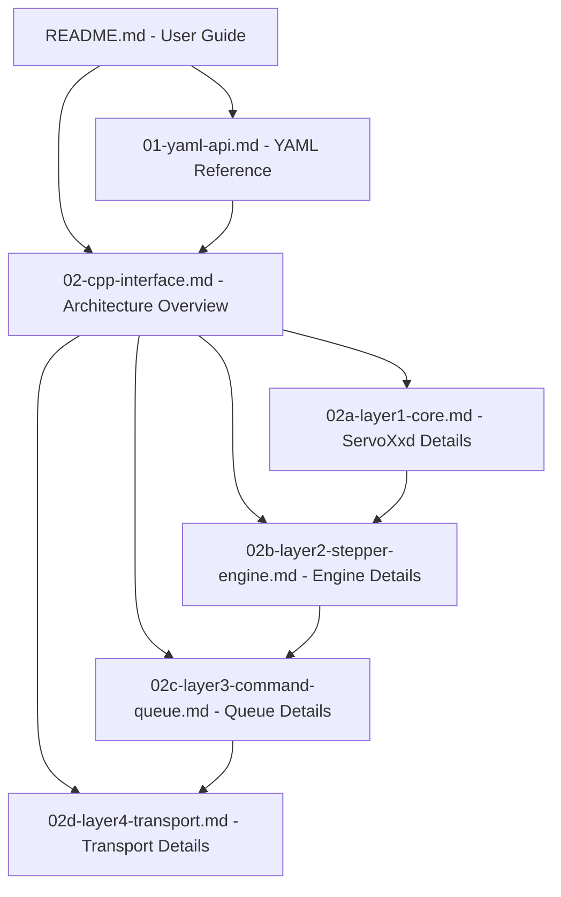

# Specification Validation Report

**Date**: 2025-10-30  
**Reviewed Documents**:
- `01-yaml-api.md` - YAML API Specification
- `02-cpp-interface.md` - C++ Interface Specification
- `02a-layer1-core.md` - Layer 1 (ServoXxd) Details
- `02b-layer2-stepper-engine.md` - Layer 2 (StepperEngine) Details
- `02c-layer3-command-queue.md` - Layer 3 (CommandQueue) Details
- `02d-layer4-transport.md` - Layer 4 (Transport) Details

**Status**: ✅ Specifications are generally valid and well-structured, with several issues requiring attention

---

## Executive Summary

The specification documents are comprehensive, well-organized, and provide excellent detail for implementing the servoxxd ESPHome component. However, several issues were identified that could lead to implementation confusion or errors:

- **3 Critical Issues** requiring immediate attention
- **3 Consistency Issues** that could cause confusion
- **4 Potential Implementation Problems** that may surface during coding
- **4 Areas of Missing Information** that should be documented
- **2 Documentation Structure Issues** affecting usability
- **3 Validation/Constraint Issues** needing clarification

**Overall Assessment**: The specifications are implementable but would benefit from addressing the identified issues before implementation begins.

---

## 1. Critical Issues

### 1.1 Conflicting Speed Calibration Information ⚠️ HIGH PRIORITY

**Location**: `02-cpp-interface.md` lines 356-367

**Issue**: The documentation contains contradictory information about speed calibration.

**Current Text**:
```
> The motor controller's speed values are **calibrated for 16/32/64 subdivisions** as reference.
> For other microstepping settings, the hardware applies an automatic scaling factor based of 16 subdivisions:
> `asked_speed = actual_speed × (16 / current_microsteps)`
```

**Problem**: 
- If calibrated for 16/32/64, why does the scaling formula use only 16 as reference?
- The example table shows × 1 (reference) for all three values 16/32/64
- The formula uses only 16 in the numerator

**Impact**: Implementers may misunderstand the actual hardware behavior, leading to incorrect speed calculations.

**Recommendation**:
- Clarify the actual hardware calibration: Is it calibrated for only 16 microsteps, or for all three (16/32/64)?
- If only 16: Change "calibrated for 16/32/64" to "calibrated for 16 microsteps"
- If all three: Explain why they all show "× 1 (reference)" but formula uses only 16
- Update example table to match the explanation

---

### 1.2 Language Inconsistency - German in English Documentation ⚠️ HIGH PRIORITY

**Location**: `02-cpp-interface.md` lines 412-451 (Acceleration Type section)

**Issue**: The acceleration hardware encoding section mixes German and English.

**Current Text**:
```
> Die Hardware verwendet einen **nicht-linearen Wert 0-255**, der die Zeitdauer zwischen diskreten Geschwindigkeitsänderungen von ±1 RPM steuert:
```

**Problem**:
- Main specification document (`02-cpp-interface.md`) should be in one language
- The YAML API document is entirely in English
- Mixing languages makes it difficult for non-German speakers to understand critical hardware behavior

**Impact**: Non-German speaking developers cannot fully understand the acceleration encoding behavior.

**Recommendation**:
- Translate all German text in `02-cpp-interface.md` to English
- Consider creating a German translation as a separate document if needed
- Ensure consistency: If audience is English developers, all technical specs should be English

---

### 1.3 Position Factory Methods Parent Pointer Ambiguity ⚠️ MEDIUM PRIORITY

**Location**: `02-cpp-interface.md` lines 468-474

**Issue**: Factory method comment claims only `from_steps()` needs parent, but `get_steps()` later uses stored parent pointer.

**Current Text**:
```cpp
static Position from_steps(int64_t steps, const ServoXxd* parent);  // Only this needs parent!
static Position from_revolutions(double revolutions);
// ...
int32_t get_steps() const;  // Steps (uses stored parent_)
```

**Problem**:
- If only `from_steps()` needs parent, how do other factory methods work?
- `get_steps()` comment says it uses stored `parent_`, implying all Positions need parent
- This creates confusion about when parent pointer is required

**Potential Implementation Issues**:
- What happens if you create Position from degrees/radians and then call `get_steps()`?
- Is `parent_` nullptr for non-steps factory methods?
- Will this cause crashes or incorrect conversions?

**Recommendation**:
Option 1: All Positions require parent
- Remove "Only this needs parent!" comment
- Require parent parameter for all factory methods
- This is cleanest but changes API

Option 2: Delayed conversion
- Store position in native format (degrees/ticks)
- Only convert to steps when parent is available
- Document that `get_steps()` requires parent to be set first

Option 3: Document current behavior clearly
- Explain what happens when parent is nullptr
- Document which operations require parent
- Add runtime checks and error messages

---

## 2. Consistency Issues

### 2.1 Mode vs OperatingMode Terminology 🔧

**Locations**: `01-yaml-api.md` (multiple), `02-cpp-interface.md` line 218

**Issue**: Inconsistent naming between YAML and C++ for the same concept.

**Current Usage**:
- YAML: `mode: POSITION` or `mode: SPEED`
- C++: `OperatingMode mode;` and `void set_mode(OperatingMode mode);`

**Problem**:
- Creates confusion when mapping YAML to C++ code
- "mode" is used in multiple contexts (operating mode, homing mode, work mode)

**Recommendation**:
- Choose consistent terminology or explicitly document the mapping
- Consider renaming C++ to match YAML: `enum class Mode` (if no conflict)
- Or rename YAML to match C++: `operating_mode: POSITION`
- Document the mapping clearly in a "YAML to C++ Reference" section

---

### 2.2 Missing Cross-Reference Document 🔧

**Location**: `02-cpp-interface.md` line 130

**Issue**: References a non-existent file.

**Current Text**:
```markdown
**⚠️ Refactoring in Progress:** See [Transport Abstraction Refactoring](./02d-layer4-transport-refactoring.md) for details
```

**Problem**:
- File `02d-layer4-transport-refactoring.md` does not exist
- Readers clicking the link will get 404 error
- Suggests incomplete documentation or outdated reference

**Recommendation**:
- Remove the reference if refactoring is complete
- Create the document if refactoring is still in progress
- Update reference to point to correct file name if renamed

---

### 2.3 Homing Mode Terminology Mix 🔧

**Location**: `01-yaml-api.md` lines 1001-1024

**Issue**: Mixes firmware-level terms with user-facing API names.

**Current Text**:
```
- VIRTUAL
  - Requirements: ... Relies on the controller's internal "return to zero" routine (0_Mode/No_Limit).
```

**Problem**:
- "0_Mode/No_Limit" is firmware jargon not appropriate for user API documentation
- Inconsistent with clean ENDSTOP/SENSORLESS/VIRTUAL naming scheme
- Confuses users who don't need to know firmware details

**Recommendation**:
- Keep VIRTUAL naming in user docs
- Move firmware term details to implementation notes
- Use consistent "VIRTUAL homing" terminology throughout
- Mention "0_Mode/No_Limit" only in Layer 4 transport documentation

---

## 3. Potential Implementation Issues

### 3.1 Single-Flight Execution Guard Thread Safety 💡

**Location**: `02c-layer3-command-queue.md` lines 42-84

**Issue**: Execution guard pattern assumes single-threaded access but doesn't explicitly state thread safety requirements.

**Current Implementation**:
```cpp
bool execution_guard_;  // Acts as mutex
```

**Problem**:
- Comment says "acts as mutex" but it's just a bool
- No mention of thread safety guarantees
- If `loop()` could be called from multiple contexts, race conditions possible

**Questions**:
- Does ESPHome guarantee single-threaded `loop()` calls?
- Could `on_modbus_data()` and `loop()` execute concurrently?
- What if WiFi callbacks trigger actions during command execution?

**Recommendation**:
- Explicitly document thread safety assumptions
- State: "ESPHome guarantees loop() is single-threaded"
- Or: Add actual mutex if concurrent access is possible
- Document that all public methods must be called from loop() thread

---

### 3.2 Position Synchronization Complexity 💡

**Location**: `02a-layer1-core.md` lines 160-199

**Issue**: Complex two-way synchronization between internal and base class position members.

**Current Design**:
```cpp
// Internal representation
Position current_pos_;
Position target_pos_;

// Base class members (public, inherited)
int32_t current_position;
int32_t target_position;

// Must sync in multiple places:
// 1. When current_pos_ changes → update current_position
// 2. When target_pos_ changes → update target_position  
// 3. In loop(), check if target_position changed externally → sync to target_pos_
```

**Problem**:
- Multiple synchronization points increase bug potential
- Easy to forget one sync point during maintenance
- External modifications to public base class members can desync state

**Potential Bugs**:
- Forgot to sync after updating position → ESPHome automation sees stale value
- Race condition if base class modified between loop() iterations
- Precision loss during steps ↔ Position conversions

**Recommendation**:
- Document all sync points clearly in code comments
- Consider accessor pattern to prevent direct base class member access
- Add debug assertions to catch desync in development builds
- Or: Reconsider if Position abstraction is worth the complexity

---

### 3.3 Callback Type Safety 💡

**Location**: `02c-layer3-command-queue.md` lines 46-50

**Issue**: Command completion callback uses simple bool but doesn't convey failure reason.

**Current Signature**:
```cpp
std::function<void(bool)> completion_callback_;
```

**Problem**:
- `true`/`false` doesn't distinguish between:
  - Success vs failure
  - Timeout vs Modbus error vs invalid response
  - Different error types requiring different recovery strategies

**Impact**:
- State machine can't make informed recovery decisions
- Error logging loses detail about failure cause
- Harder to debug issues in the field

**Recommendation**:
Option 1: Enum result type
```cpp
enum class CommandResult { SUCCESS, TIMEOUT, MODBUS_ERROR, INVALID_DATA };
std::function<void(CommandResult)> completion_callback_;
```

Option 2: Separate callbacks
```cpp
std::function<void()> success_callback_;
std::function<void(ErrorType)> error_callback_;
```

Option 3: Rich result object
```cpp
struct CommandResult {
  bool success;
  ErrorType error;
  std::string message;
};
std::function<void(const CommandResult&)> completion_callback_;
```

---

### 3.4 Speed Hardware Compensation API Confusion 💡

**Location**: `02-cpp-interface.md` line 332, 367

**Issue**: Exposing hardware compensation methods creates confusing public API.

**Current Methods**:
```cpp
int16_t get_rpm() const;              // User-facing RPM
int16_t rpm_for_hardware() const;     // Microstepping-compensated RPM
```

**Problem**:
- Users see two RPM methods and don't know which to use
- `rpm_for_hardware()` is implementation detail that should be private
- Violates encapsulation: users shouldn't need to know about hardware quirks

**Recommendation**:
- Make `rpm_for_hardware()` private
- Only expose user-facing `get_rpm()`
- Hardware compensation should be completely transparent
- Document internally where compensation is applied

---

## 4. Missing Information

### 4.1 Error Recovery Strategy 📝

**Location**: Layer 2 specification (`02b-layer2-stepper-engine.md`)

**Issue**: State machine shows Error state but recovery details are incomplete.

**What's Documented**:
- `* → Error` transitions
- `release_protection()` action exists

**What's Missing**:
- What happens to queued commands during error?
- Can operations resume or must component restart?
- Are there different error severities with different recovery paths?
- How do transient communication errors differ from hardware protection errors?

**Impact**:
- Implementers must guess recovery behavior
- Inconsistent error handling across error types
- Users don't know what to expect after errors

**Recommendation**:
Add section "Error Recovery Flows" documenting:
- Transient error (e.g. Modbus timeout) → automatic retry, stay in current state
- Hardware protection error → Error state, require `release_protection()`
- Configuration error → Error state, require configuration fix and restart
- Queue behavior during errors (clear, preserve, pause)
- State transitions during recovery

---

### 4.2 Timeout Value Guidelines 📝

**Location**: Multiple locations mention timeouts but no default values specified

**What's Missing**:
- Default timeout for read commands (100ms? 500ms?)
- Default timeout for write commands
- Default timeout for movement commands (depends on distance?)
- How to choose timeout values for user commands

**Impact**:
- Implementers choose arbitrary values
- Too short → false timeout errors
- Too long → poor responsiveness
- No guidance for users setting custom timeouts

**Recommendation**:
Add section "Timeout Guidelines":
- Default timeout: 500ms for register read/write
- Movement timeout: `(distance / speed) + margin`
- Homing timeout: Based on max travel distance
- User-configurable: `timeout` parameter on actions
- Timeout multiplier for slow networks

---

### 4.3 Position Split Format Implementation Example 📝

**Location**: `02-cpp-interface.md` lines 529-535

**Issue**: Describes carry/borrow behavior but no code example.

**Current Text**:
```
Wenn angle_ticks ≥ 16384:  revolutions++, angle_ticks -= 16384
Wenn angle_ticks < 0:      revolutions--, angle_ticks += 16384
```

**Problem**:
- Complex arithmetic prone to off-by-one errors
- No example showing correct implementation
- Unclear how to handle negative positions

**Recommendation**:
Add implementation example:
```cpp
// Example: Adding two positions with carry handling
Position Position::operator+(const Position& rhs) const {
  // Convert to total ticks
  int64_t total_ticks = (revs_ * 16384) + angle_ticks_ + 
                        (rhs.revs_ * 16384) + rhs.angle_ticks_;
  
  // Split with proper carry/borrow
  int32_t new_revs = total_ticks / 16384;
  uint16_t new_angle = total_ticks % 16384;
  
  // Handle negative modulo
  if (new_angle < 0) {
    new_revs--;
    new_angle += 16384;
  }
  
  return Position(new_revs, new_angle, parent_);
}
```

---

### 4.4 Command Priority Definitions 📝

**Location**: `02c-layer3-command-queue.md` mentions "priority handling" but no definitions

**Issue**: No priority levels or rules defined.

**What's Mentioned**:
- "Critical Commands" (e.g. emergency_stop clears queue)

**What's Missing**:
- Priority level definitions (e.g. CRITICAL, HIGH, NORMAL, LOW)
- Which commands have which priority?
- How does priority affect queue ordering?
- Can high priority commands preempt executing commands?

**Impact**:
- Implementer must invent priority scheme
- Inconsistent priority handling
- May not meet real-time requirements

**Recommendation**:
Add "Command Priority System":
```
Priority Levels:
- CRITICAL: emergency_stop → clears queue, executes immediately
- HIGH: enable, disable, release_protection → insert at front
- NORMAL: move, set_speed, set_target → FIFO order
- LOW: status queries → can be dropped if queue full

Rules:
- CRITICAL commands clear all pending (not executing) commands
- HIGH commands insert at queue front after current executing
- NORMAL/LOW follow FIFO order
- Deduplication applies within same priority level
```

---

## 5. Documentation Structure Issues

### 5.1 Circular Reference Navigation 📚

**Issue**: Documents reference each other extensively but navigation could be clearer.

**Current Structure**:
```
02-cpp-interface.md (overview)
  ├─ References 02a, 02b, 02c, 02d (layer details)
  └─ References 01-yaml-api.md

02a-layer1-core.md
  ├─ References 02-cpp-interface.md (parent)
  ├─ References 02b-layer2-stepper-engine.md (next)
  └─ References 01-yaml-api.md
```

**Problem**:
- Easy to get lost navigating between documents
- No clear "start here" for first-time readers
- Missing visual overview of document relationships

**Recommendation**:
Add to README or new SPECIFICATION-INDEX.md:


Recommended reading order:
1. README.md - Understand what the component does
2. 01-yaml-api.md - Understand user-facing API
3. 02-cpp-interface.md - Understand architecture
4. 02a-02d - Deep dive into implementation layers

---

### 5.2 Audience Clarity 📚

**Location**: `01-yaml-api.md` line 5

**Issue**: Unclear who the intended audience is.

**Current Text**:
```markdown
**Audience:** This document is for **developers** implementing the component. 
For end-user documentation, see [README.md](../../README.md).
```

**Problem**:
- "developers" could mean:
  - Component maintainers (working on this codebase)
  - ESPHome users (writing YAML configs)
  - Third-party developers (extending the component)

**Impact**:
- Readers unsure if document is relevant to them
- May skip important information
- May expect information that isn't there

**Recommendation**:
Be more specific:
```markdown
**Audience:** 
- **Primary**: Component maintainers implementing the C++ codebase
- **Secondary**: Contributors extending the component

This document specifies the complete YAML API that must be implemented. 
It serves as the authoritative reference for the Python validation layer.

**Not for**: End users should read [README.md](../../README.md) instead.
```

---

## 6. Validation/Constraint Issues

### 6.1 Working Current Validation Order ⚙️

**Location**: `01-yaml-api.md` lines 802-845

**Issue**: Maximum current depends on `servo_type` but validation order unclear.

**Current Spec**:
```yaml
working_current: 2.5A
servo_type: SERVO42D  # max 3.0A
```

**Questions**:
- Is `working_current` validated when set, or when `servo_type` is set?
- What if `working_current` is defined before `servo_type` in YAML?
- What if user changes `servo_type` at runtime - is `working_current` revalidated?

**Problem**:
- Validation order affects error messages and user experience
- Unclear when constraints are enforced
- Runtime validation behavior undefined

**Recommendation**:
Document validation strategy:
```
Validation Order:
1. Parse all fields
2. Apply defaults for missing fields
3. Cross-validate dependent fields in this order:
   a. servo_type must be set (required field)
   b. working_current validated against servo_type max
   c. homing.current validated against servo_type max
4. Runtime actions: revalidate current against servo_type before sending
```

---

### 6.2 Unit Conversion Edge Cases ⚙️

**Location**: Multiple locations with unit conversions

**Issue**: No discussion of overflow, underflow, or precision loss.

**Examples**:
- `int32_t get_steps_per_sec()` - can overflow for high RPM with many steps/rev
- Position conversions to/from arcseconds - precision loss?
- Acceleration RPM/s to hardware 0-255 mapping - rounding behavior?

**Missing Documentation**:
- What happens on overflow? Clamp? Error? Undefined?
- How much precision is lost in conversions?
- Are conversions bidirectional (can you round-trip without loss)?

**Recommendation**:
Add section "Unit Conversion Guarantees":
```
Overflow Behavior:
- Speed conversions: Clamp to hardware limits (-3000 to +3000 RPM)
- Position conversions: int32_t range ±2^31 steps supported
- Acceleration: Map to nearest 0-255 value, may lose precision

Precision:
- Speed: ±1 RPM precision
- Position: ±1 step precision (encoder native)
- Acceleration: ~78-20000 RPM/s range, non-linear quantization

Round-trip Conversions:
- Steps ↔ Steps: Exact (no conversion)
- RPM ↔ RPM: ±1 RPM (hardware quantization)
- Degrees ↔ Steps: Depends on steps_per_revolution (may lose decimal)
```

---

### 6.3 Microstepping Uncalibrated Values ⚙️

**Location**: `01-yaml-api.md` lines 614-642

**Issue**: Allows 1-256 range but only 16/32/64 are calibrated.

**Current Spec**:
```yaml
microsteps: 32  # Calibrated value (no correction needed)
# BUT: validation allows 1-256
```

**Problem**:
- Users might set uncalibrated values (e.g. 128) without understanding speed will be wrong
- Warning is present but easy to miss
- No runtime indication that value is uncalibrated

**Impact**:
- Motor runs at wrong speed
- User doesn't understand why speed is incorrect
- Difficult to debug

**Recommendation**:
Option 1: Restrict to calibrated values
```python
cv.one_of(16, 32, 64)  # Only allow calibrated
```

Option 2: Warning at compile time
```python
if microsteps not in [16, 32, 64]:
    logger.warning(f"microsteps {microsteps} is not factory-calibrated. "
                   f"Speed will require software compensation. "
                   f"Recommended values: 16, 32, or 64")
```

Option 3: Automatic compensation
- Document that component auto-compensates for all values
- Test and validate compensation accuracy
- Make it transparent to users

---

## 7. Additional Observations

### 7.1 Strengths of the Specification ✅

The specification has many excellent qualities:

1. **Comprehensive Coverage**: All aspects of the component are documented
2. **Layered Architecture**: Clean separation of concerns
3. **Type Safety**: Strong typing with unit classes
4. **ESPHome Integration**: Good integration with ESPHome patterns
5. **Examples**: Good use of examples throughout
6. **Cross-References**: Documents link to each other well
7. **Design Patterns**: Clear use of Facade, State Machine, Command Queue patterns

### 7.2 Minor Formatting Issues ✍️

Some minor formatting inconsistencies noted:

1. Inconsistent use of **bold** vs _italic_ for emphasis
2. Some code blocks missing language specifiers
3. Table formatting varies between documents
4. Emoji usage inconsistent (some sections use, others don't)

These don't affect functionality but could be normalized for polish.

### 7.3 Positive Aspects Worth Highlighting 🌟

Especially well-done sections:

1. **Command Validation Matrix** (02b) - Excellent visual reference
2. **Type Optimization Rationale** (02-cpp-interface) - Rare to see mathematical justification
3. **Hardware Encoding Explanations** - Detailed explanation of non-linear acceleration mapping
4. **Single-Flight Pattern** (02c) - Clear execution flow description
5. **Factory Methods** - Good use of static factory pattern for Position

---

## 8. Prioritized Recommendations

### Immediate Actions (Before Implementation)

1. **Fix Speed Calibration Contradiction** (Issue 1.1) - Critical for correct implementation
2. **Translate German Text** (Issue 1.2) - Accessibility issue
3. **Remove Dead Link** (Issue 2.2) - Broken documentation
4. **Clarify Position Parent Pointer** (Issue 1.3) - Potential crashes

### Before Alpha Release

5. **Document Error Recovery** (Issue 4.1) - Critical for production use
6. **Add Timeout Guidelines** (Issue 4.2) - Prevents configuration errors
7. **Improve Callback Type Safety** (Issue 3.3) - Better error handling
8. **Document Thread Safety** (Issue 3.1) - Prevent race conditions

### Polish for Production

9. **Normalize Terminology** (Issue 2.1, 2.3) - Consistency
10. **Add Position Example Code** (Issue 4.3) - Prevent bugs
11. **Document Priority System** (Issue 4.4) - Clearer behavior
12. **Improve Navigation** (Issue 5.1, 5.2) - Better UX
13. **Strengthen Validation** (Issues 6.1, 6.2, 6.3) - Prevent user errors

---

## 9. Conclusion

**Overall Assessment**: ⭐⭐⭐⭐ (4/5)

The specification is **well-crafted and implementable**. The identified issues are manageable and don't fundamentally undermine the design. The architecture is sound, and the documentation is comprehensive.

**Key Strengths**:
- Thorough coverage of all components
- Clear architectural layering
- Good separation of concerns
- Strong type safety
- ESPHome integration well thought out

**Key Weaknesses**:
- Some critical ambiguities need resolution
- Missing error handling details
- Language inconsistencies
- Some validation logic unclear

**Recommendation**: 
✅ **Proceed with implementation** after addressing the 4 immediate-action items above. The remaining issues can be resolved during implementation or before alpha release.

---

**Report Generated**: 2025-10-30  
**Reviewed By**: GitHub Copilot Coding Agent  
**Review Type**: Comprehensive Specification Validation
